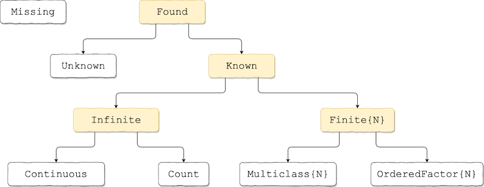

[MLJ homepage](https://github.com/alan-turing-institute/MLJ.jl)


# Getting Started

### Basic supervised training and testing


```julia
julia> using MLJ
julia> using RDatasets
julia> iris = dataset("datasets", "iris"); # a DataFrame
```

In MLJ one can either wrap data for supervised learning in a formal
*task* (see [Working with Tasks](working_with_tasks.md)), or work directly with the
data, split into its input and target parts:


```julia
julia> const X = iris[:, 1:4];
julia> const y = iris[:, 5];
```

A *model* is a container for hyperparameters. Assuming the
DecisionTree package is in your installation load path, we can
instantiate a DecisionTreeClassifier model like this:

```julia
julia> @load DecisionTreeClassifier
import MLJModels ✔
import DecisionTree ✔
import MLJModels.DecisionTree_.DecisionTreeClassifier ✔

julia> tree_model = DecisionTreeClassifier(target_type=String, max_depth=2)
DecisionTreeClassifier(target_type = String,
                       pruning_purity = 1.0,
                       max_depth = 2,
                       min_samples_leaf = 1,
                       min_samples_split = 2,
                       min_purity_increase = 0.0,
                       n_subfeatures = 0.0,
                       display_depth = 5,
                       post_prune = false,
                       merge_purity_threshold = 0.9,) @ 1…72
```

Wrapping the model in data creates a *machine* which will store training outcomes (called *fit-results*):

```julia
julia> tree = machine(tree_model, X, y)
Machine @ 5…78
```

Training and testing on a hold-out set:

```julia
julia> train, test = partition(eachindex(y), 0.7, shuffle=true); # 70:30 split
julia> fit!(tree, rows=train)
julia> yhat = predict(tree, X[test,:]);
julia> misclassification_rate(yhat, y[test]);

┌ Info: Training Machine{DecisionTreeClassifier{S…} @ 1…36.
└ @ MLJ /Users/anthony/Dropbox/Julia7/MLJ/src/machines.jl:68
0.08888888888888889
```

Or, in one line:

```julia
julia> evaluate!(tree, resampling=Holdout(fraction_train=0.7, shuffle=true), measure=misclassification_rate)
0.08888888888888889
```

Changing a hyperparameter and re-evaluating:

```julia
julia> tree_model.max_depth = 3
julia> evaluate!(tree, resampling=Holdout(fraction_train=0.5, shuffle=true), measure=misclassification_rate)
0.06666666666666667
```

### Next steps

To learn a little more about what MLJ can do, take the MLJ
[tour](https://github.com/alan-turing-institute/MLJ.jl/blob/master/docs/src/tour.ipynb). Read
the remainder of this document before considering more serious use of
MLJ.


### Prerequisites

MLJ assumes some familiarity with the
[CategoricalArrays.jl](https://github.com/JuliaData/CategoricalArrays.jl)
package, used for representing categorical data. For probabilistic
predictors, a basic acquaintance with
[Distributions.jl](https://github.com/JuliaStats/Distributions.jl) is
also assumed.


### Data containers and scientific types

The MLJ user should acquaint themselves with some
basic assumptions about the form of data expected by MLJ, as outlined
below. 

In principle, anywhere a table is expected in MLJ - for example, `X` above - any
tabular format supporting the
[Tables.jl](https://github.com/JuliaData/Tables.jl) interface is
allowed. (At present our API is more restrictive; see this
[issue](https://github.com/JuliaData/Tables.jl/issues/74) with
Tables.jl. If your Tables.jl compatible format is not working in MLJ,
please post an issue.) In particular, `DataFrame`,
`JuliaDB.IndexedTable` and `TypedTables.Table` objects are supported,
as are named tuples of equi-length vectors ("column tables" in
Tables.jl parlance).

A single feature (such as the target `y` above) is expected to be a
`Vector` or `CategoricalVector`, according to the *scientific type* of
the data (see below). A multivariate target can be any table.

On the other hand, the element types you use to represent your data
has implicit consequences about how MLJ will interpret that data.

> WIP: Eventually users will use task constructors to coerce element
> types into the requisite form. At present, the user must do so
> manually, before passing data to the constructors.

To articulate MLJ's conventions about data representation, MLJ
distinguishes between *machine* data types on the one hand (`Float64`,
`Bool`, `String`, etc) and *scientific data types* on the other,
represented by new Julia types: `Continuous`, `Multiclass{N}`,
`FiniteOrderedFactor{N}`, and `Count` (unbounded ordered factor), with
obvious interpretations. These types are organized in a type
hierarchy rooted in a new abstract type `Found`:



Note that `Multiclass{2}` has the alias `Binary`.

A *scientific type* is any subtype of
`Union{Missing,Found}`. Scientific types have no instances.

Scientific types appear when querying model metadata, as in this
example:

```julia
julia> info("DecisionTreeClassifier")[:target_scitype]

Union{Multiclass,FiniteOrderedFactor}
```

**Basic data convention.** The scientific type of data that a Julia
object `x` can represent is defined by `scitype(x)`. If `scitype(x) ==
Other`, then `x` cannot represent scalar data in MLJ.

```julia
julia> (scitype(42), scitype(π), scitype("Julia"))

(Count, Continuous, MLJBase.Other)
```

In particular, *integers cannot be used to represent* `Multiclass` *or*
`FiniteOrderedFactor` *data*; these can be represented by an unordered or
ordered `CategoricalValue` or `CategoricalString`:

`T`                     |     `scitype(x)` for `x::T`
------------------------|:--------------------------------
`Missing`                 |      `Missing`
`Real`                    |      `Continuous`
`Integer`                |        `Count`
`CategoricalValue`       | `Multiclass{N}` where `N = nlevels(x)`, provided `x.pool.ordered == false` 
`CategoricalString`       | `Multiclass{N}` where `N = nlevels(x)`, provided `x.pool.ordered == false`
`CategoricalValue`       | `FiniteOrderedFactor{N}` where `N = nlevels(x)`, provided `x.pool.ordered == true` 
`CategoricalString`       | `FiniteOrderedFactor{N}` where `N = nlevels(x)` provided `x.pool.ordered == true`
`Integer`                 | `Count`

Here `nlevels(x) = length(levels(x.pool))`.

