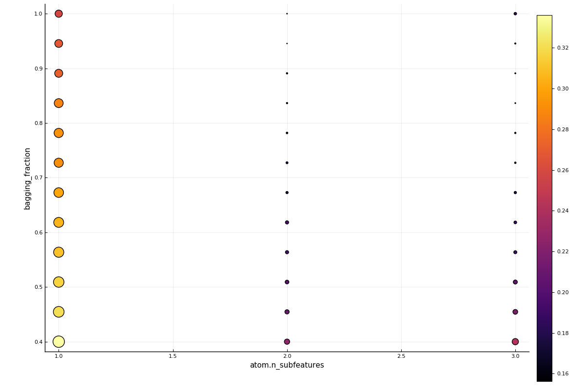

# Tuning models

In MLJ tuning is implemented as a model wrapper. After wrapping a
model in a tuning strategy and binding the wrapped model to data in a
machine, fitting the machine instigates a search for optimal model
hyperparameters, within the specified range, and then uses all
supplied data to train the best model. Making predictions using this
fitted machine then amounts to predicting using a machine based on the
unwrapped model with the specified hyperparameters optimized. In this
way the wrapped model may be viewed as a "self-tuning" version of the
    unwrapped model.


### Tuning a single hyperparameter

```@example goof
using MLJ
X = (x1=rand(100), x2=rand(100), x3=rand(100))
y = 2X.x1 - X.x2 + 0.05*rand(100)
tree_model = @load DecisionTreeRegressor
```
    
Let's tune `min_purity_increase` in the model
above, using a grid-search. Defining hyperparameter ranges and
wrapping the model:

```@example goof
r = range(tree_model, :min_purity_increase, lower=0.001, upper=1.0, scale=:log)
self_tuning_tree_model = TunedModel(model=tree_model,
                                    resampling = CV(nfolds=3),
                                    tuning = Grid(resolution=10),
                                    ranges = r,
                                    measure = rms);
```

Incidentally, for a numeric hyperparameter, the object returned by
`range` can be iterated after specifying a resolution:

```@example goof
iterator(r, 5)
```

Non-numeric hyperparameters are handled a little differently:

```@example goof
selector_model = FeatureSelector()
r2 = range(selector_model, :features, values = [[:x1,], [:x1, :x2]])
iterator(r2)
```
    
Returning to the wrapped tree model:

```@example goof
self_tuning_tree = machine(self_tuning_tree_model, X, y)
fit!(self_tuning_tree)
```

We can inspect the detailed results of the grid search with
`report(self_tuning_model)` or just retrieve the optimal model, as here:

```@example goof
fitted_params(self_tuning_tree).best_model
```

Predicting on new input observations using the optimal model:

```@example goof
predict(self_tuning_tree, (x1=rand(3), x2=rand(3), x3=rand(3)))
```


### Tuning multiple nested hyperparameters
    
The following model has another model, namely a `DecisionTreeRegressor`, as a
hyperparameter:

```@example goof
tree_model = DecisionTreeRegressor()
forest_model = EnsembleModel(atom=tree_model)
```

Nested hyperparameters are conveniently inspected using `params`:

```@example goof
params(forest_model)
```

Ranges for nested hyperparameters are specified using dot syntax:

```@example goof
r1 = range(forest_model, :(atom.n_subfeatures), lower=1, upper=3)
r2 = range(forest_model, :bagging_fraction, lower=0.4, upper=1.0);
self_tuning_forest_model = TunedModel(model=forest_model, 
                                      tuning=Grid(resolution=12),
                                      resampling=CV(nfolds=6),
                                      ranges=[r1, r2],
                                      measure=rms)
self_tuning_forest = machine(self_tuning_forest_model, X, y)
fit!(self_tuning_forest, verbosity=0)
report(self_tuning_forest)
```

In this two-parameter case, a plot of the grid search results is also
available:

```julia
using Plots
plot(self_tuning_forest)
```




### API

```@docs
MLJ.range
MLJ.TunedModel
```
